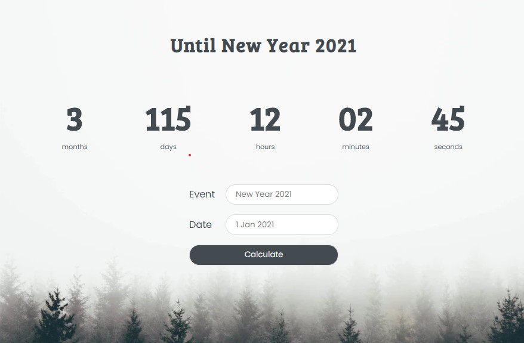

# Countdown Timer App With Vanilla JS

An app that can calcualtes and displays the days remaining until the new year 2021. User can also enter their custom event and date for the event and calculate the days remaining.

- Inspiration: https://github.com/florinpop17/10-projects-10-hours
- Design: [https://uidesigndaily.com/posts/sketch-countdown-timer-day-876](https://uidesigndaily.com/posts/sketch-countdown-timer-day-876)

Extra Features added by me

- Display Months
- Custom user events

Running the app

- Clone the repo or download the zip file and extract
- Open index.html
